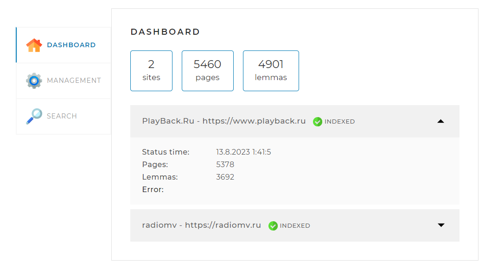
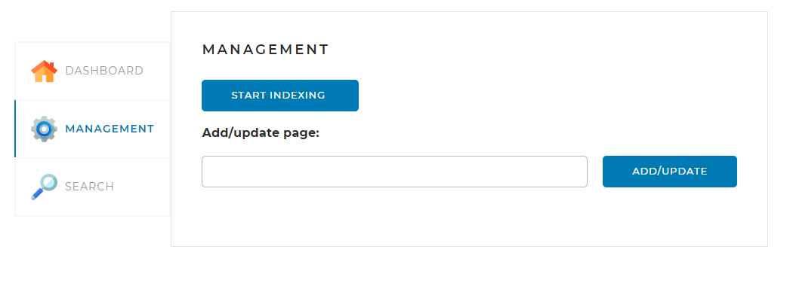
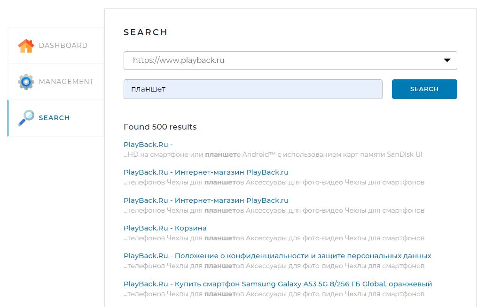

# Проект «Поисковый движок»

Данное приложение реализует поисковый движок, предоставляющий пользователю API со следующими функциями:
<li>вывод общей статистики проиндексированных сайтов</li>
<li>индексация сайтов, указанных в конфиг фале</li>
<li>принудительная остановка индексации сайтов</li>
<li>индексация отдельно заданной страницы сайта, указанного в конфиг файле</li>
<li>поиск страниц по указанному поисковому запросу</li>

## Стэк используемых технологий
<li>Java 17</li>
<li>SpringBoot 2.7.10</li>
<li>JPA</li>
<li>MySQL</li>
<li>JSOUP</li>
<li>Morphology Library Lucene</li>
<li>Lombok</li>
<li>Flyway</li>

## Веб-интерфейс
В состав веб-интерфейса входит страница с тремя кладками:

### DASHBOARD

 
Данная вкладка открывается по умолчанию. На ней отображается общая и детальная статистика 
по всем проиндексированным сайтам.

Запрос: <i>/api/statistics</i>>

### MANAGEMENT

 
Данная вкладка отвечает за управление поисковым движком. 

Запрос: <i>/api/startIndexing</i>> - начало индексации по всем сайтам

Запрос: <i>/api/stopIndexing</i>> - принудительная остановка индексации

Запрос: <i>/api/indexPage/{pagePath}</i>> - добавление/обновление отдельной страницы

### SEARCH

 
Данная вкладка предназначена для тестирования поискового движка. На ней находится поле поиска, 
выпадающий список с выбором сайта для поиска.

Запрос: <i>/api/search</i>>

## Настройки для запуска
### Настройка подключения к БД
Проект использует БД MySQL. Для запуска, убедитесь, что у вас запущен сервер MySQL и создана БД <i>search_engine</i>.
Замените логин и пароль в конфиг файле <i>src/resources/application.yml</i>.
 
`datasource:
username: user1 (логин)
password: user1 (пароль)`

### Настройка сайтов для индексации
Задайте необходимые сайты для индексации в конфиг файле <i>src/resources/application.yml</i>
 
`sites:
url: https://www.playback.ru/
name: PlayBack.Ru
url: https://radiomv.ru/
name: radiomv`

### Запуск приложения
Запустите проект и откройте его через браузер по адресу: [http://localhost:8080/](http://localhost:8080/)